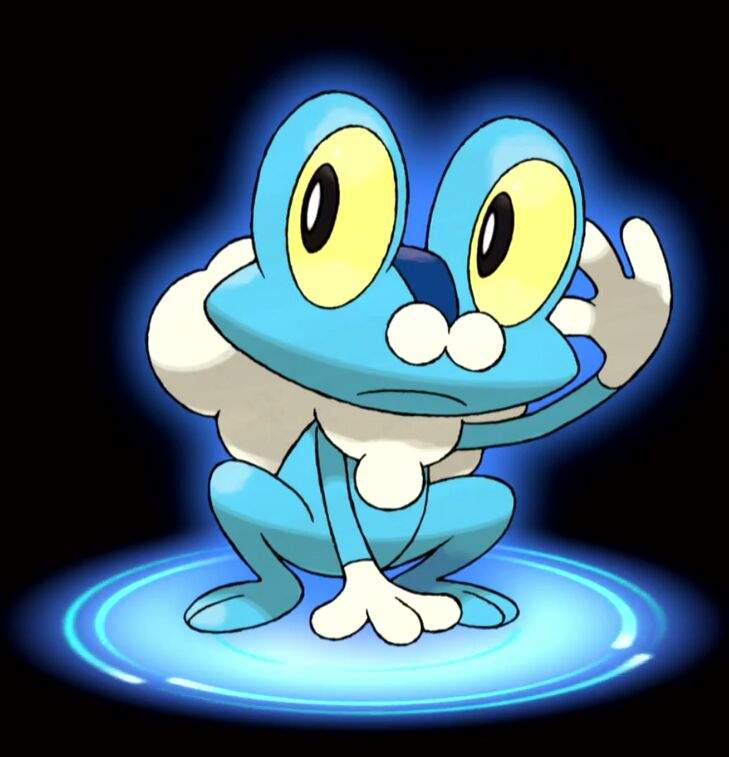
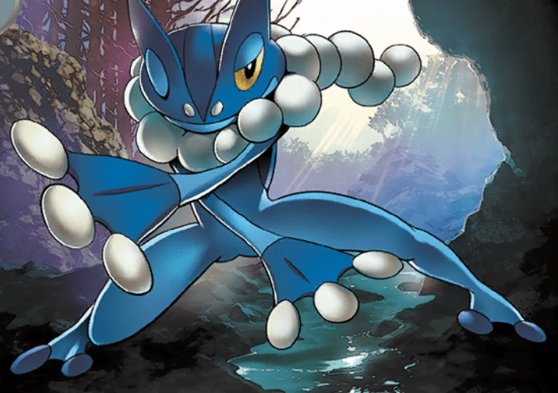
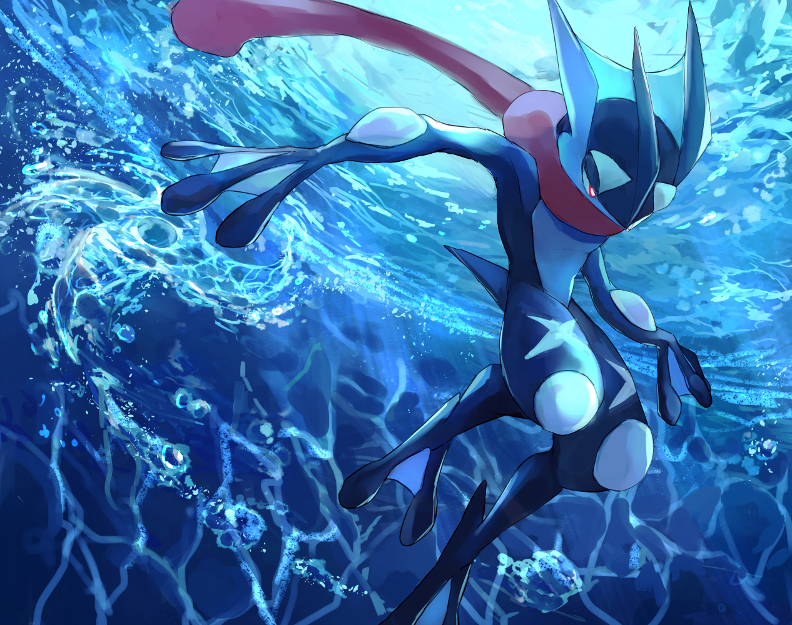

### Know Greninja 
If you clicked this page than you might want to know about Geninja. Greninja is the gen 6 water starter pokemon. It is water and dark type. this pokemon's evolution line is Froakie,Frogadear, and Greninja.

